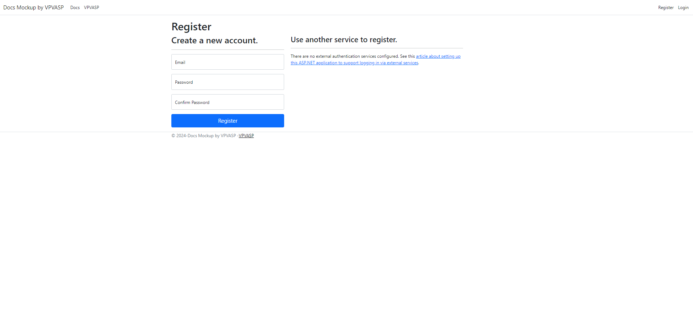
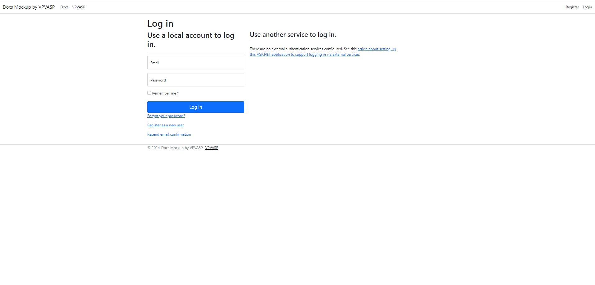

# ASP.NET-Core-DocsMockup
Developed a Google Docs-like application using ASP.NET Core with TinyMCE and SQL Database for data storage. Implemented user authentication, document creation/modification/deletion and PDF export functionality.

## Technologies Used:
- ASP.NET Core, TinyMCE, SQL, C#

## How to Install
1. Clone this GitHub Repository to your computer.
2. Open the Project .sln file in Visual Studio and run it.

## Screenshots

